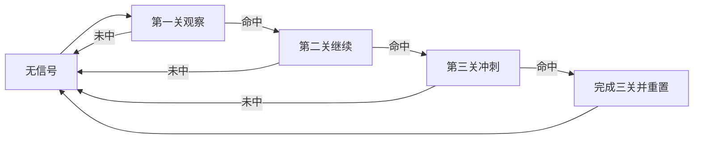

# 当前项目产品优化方案

## 1. 文档目标

本文用于把当前项目从“功能堆叠型看板”优化为“决策导向型工具”。优化重点不是增加更多模块，而是让用户打开页面后能快速判断：

- 今天应该看哪个模块；
- 当前是否有值得跟踪的信号；
- 推荐结果是否可信；
- 数据同步是否正常；
- 下一步应该观察、继续、重置还是回避。

## 2. 当前项目定位

当前项目包含两条主要业务线：

| 业务线 | 当前能力 | 产品定位 |
|---|---|---|
| 彩票开奖规律 | 澳门 / 香港开奖记录采集、三中三公式、闯三关、历史窗口回测 | 历史规律观察与下期候选号辅助工具 |
| 世界杯比分预测 | 世界杯开售赛事、比分推荐、完赛校验、数据源诊断 | 足球比分预测与赛后复盘看板 |

建议统一定位为：

> 基于历史数据、当前数据源和规则模型的决策辅助看板，核心价值是“降低筛选成本、暴露风险、沉淀复盘”，不是承诺命中。

## 3. 当前主要问题

| 问题 | 表现 | 产品影响 |
|---|---|---|
| 首页主次不清 | 功能多、表格多、入口多 | 用户不知道先看哪里 |
| 推荐和复盘混在一起 | 当前推荐、历史回测、公式解释同屏堆叠 | 决策路径变长 |
| 数据状态不够前置 | 采集失败、完赛未同步等信息需要深入查 | 用户容易误以为模型错误 |
| 三中三 / 闯三关口径需要产品化 | 用户关心“何时开始买第一关、何时进第二关、何时冲第三关” | 当前更像公式实验台，不像操作工具 |
| 世界杯页面信息密度高 | 主推、备用、博冷、情报、完赛校验都很重 | 重点比赛和风险场不够突出 |

## 4. 优化后的三层信息架构

### 第一层：首页总控台

首页只负责回答“现在该看什么”。

| 区域 | 内容 | 目标 |
|---|---|---|
| 今日重点 | 世界杯 / 三中三 / 闯三关的当前状态卡 | 一屏判断重点模块 |
| 数据健康 | 彩票采集时间、世界杯采集时间、数据源异常 | 避免基于旧数据判断 |
| 推荐入口 | 三中三推荐、闯三关判断、世界杯比分预测 | 快速进入专项页 |
| 风险提醒 | 数据异常、公式失效、连续未中、完赛未同步 | 提前提示不要盲跟 |

首页不再承担完整分析，只展示摘要和入口。

### 第二层：专项决策页

每个专项页只解决一个核心决策。

| 页面 | 核心问题 | 用户完成动作 |
|---|---|---|
| 三中三公式页 | 下期推荐哪些号码 | 查看 6 码复式或多个单式 |
| 闯三关页 | 当前是第几关，是否继续 | 判断第一关、第二关、第三关状态 |
| 世界杯比分预测页 | 哪些比赛值得跟踪 | 查看主推 / 备用 / 博冷与风险 |

### 第三层：复盘验证层

复盘层给高级用户或自己验证模型使用。

| 模块 | 作用 |
|---|---|
| 历史回测 | 验证公式长期表现 |
| 最近表现 | 看最近 10 期或最近比赛走势 |
| 最大连挂 | 判断风险上限 |
| 完赛校验 | 看比分预测是否命中 |
| 数据源诊断 | 判断采集问题还是模型问题 |

## 5. 首页优化方案

首页建议改为“总控台 + 三个核心入口”的结构。

### 5.1 首屏结构

| 模块 | 展示内容 |
|---|---|
| 顶部状态条 | 最新采集时间、澳门 / 香港 / 世界杯数据状态 |
| 今日决策摘要 | 当前最值得看的 1 到 3 个结论 |
| 三个主入口卡片 | 三中三、闯三关、世界杯比分 |
| 风险提示区 | 数据异常、公式断关、完赛同步异常 |

### 5.2 首页文案口径

推荐使用“动作型文案”，少用解释型文案。

| 当前表达倾向 | 建议表达 |
|---|---|
| 公式评分总表 | 当前公式健康度 |
| 条件触发总表 | 当前是否适合跟踪 |
| 完赛比分校验 | 昨日比分命中复盘 |
| 数据源诊断 | 数据同步状态 |

## 6. 三中三公式页优化方案

三中三页面的核心不是展示所有公式，而是给出“下期怎么选”。

### 6.1 页面主决策

| 区域 | 内容 |
|---|---|
| 下期推荐 | 最多 6 码复式 |
| 单式拆分 | 3 到 5 组单式候选 |
| 当前公式组 | 当前采用的公式组名称、近期命中率 |
| 风险状态 | 最近命中、当前连挂、是否建议降权 |
| 公式来源 | 每个号码来自哪些公式 |

### 6.2 推荐口径

建议明确分为两类：

| 类型 | 规则 |
|---|---|
| 6 码复式 | 从当前最优公式组输出，最多 6 个号码 |
| 多个单式 | 从 6 码里拆成多个 3 码组合，优先覆盖高权重号码 |

### 6.3 必须避免

- 不展示“未来数据参与验证”的结果；
- 不把历史最优公式直接当下期公式；
- 不让用户误以为每期都自动换公式一定更优；
- 不用复杂表格盖过最终推荐。

## 7. 闯三关页优化方案

闯三关页面应从“公式复盘页”优化为“关卡判断页”。

### 7.1 三关定义

| 关卡 | 产品含义 | 页面动作 |
|---|---|---|
| 第一关 | 公式组刚开始出现可观察信号 | 显示“开始观察 / 小注验证” |
| 第二关 | 第一关命中后，公式进入连续性验证 | 显示“可继续跟踪” |
| 第三关 | 第二关命中后，进入冲刺观察 | 显示“谨慎冲刺 / 命中后重置” |

### 7.2 状态机

### 7.3 页面重点

| 区域 | 内容 |
|---|---|
| 当前关卡 | 第一关 / 第二关 / 第三关 / 无信号 |
| 本关号码池 | 当前公式生成的号码 |
| 进入下一关条件 | 命中几个号码算过关 |
| 失败处理 | 未中后是否重置、是否观察下一组 |
| 历史表现 | 最近完成三关次数、最大断关 |

## 8. 世界杯比分预测页优化方案

世界杯页面已经具备数据源、比分推荐和完赛校验，下一步重点是降低信息密度。

### 8.1 页面分区

| 区域 | 内容 | 优先级 |
|---|---|---|
| 今日可跟踪比赛 | 只列可跟踪和观察场 | P0 |
| 比分推荐 | 主推、备用、博冷、置信度 | P0 |
| 风险解释 | 冷门风险、平局概率、情报质量 | P0 |
| 完赛复盘 | 命中 / 半中 / 未中 | P0 |
| 数据源状态 | 500、ESPN、FIFA、更新时间 | P1 |
| 参考信息 | 冠军、小组、出线概率 | P2 |

### 8.2 推荐状态

| 状态 | 含义 | 页面表现 |
|---|---|---|
| 可跟踪 | 模型、情报、盘口状态较一致 | 高亮显示 |
| 观察 | 有方向但风险未消除 | 普通显示 |
| 回避 | 数据冲突或冷门风险高 | 灰色 / 风险标签 |
| 等待数据 | 开售或完赛数据缺失 | 显示同步提示 |

### 8.3 完赛复盘口径

| 命中类型 | 定义 |
|---|---|
| 命中 | 主推比分等于实际比分 |
| 半中 | 方向命中但比分未中，或备用 / 博冷命中 |
| 未中 | 方向和比分均未覆盖 |

## 9. 数据同步与异常提示方案

数据状态需要前置到首页和专项页顶部。

| 异常 | 用户提示 | 产品动作 |
|---|---|---|
| 彩票页面采集失败 | 当前开奖数据可能不是最新 | 禁止显示强推荐，只显示观察 |
| 世界杯完赛未同步 | 完赛复盘未更新 | 显示数据源诊断入口 |
| 500 开售列表为空 | 当前无可串关赛事或采集异常 | 使用上一轮数据需明显标记 |
| ESPN 完赛源异常 | 完赛校验可能缺失 | 使用 FIFA / 静态兜底并提示 |
| 本地数据过期 | 数据超过设定时间未刷新 | 首页顶部红色提示 |

## 10. P0 / P1 / P2 优先级

### P0：先解决用户决策路径

| 任务 | 目标 |
|---|---|
| 首页总控台重构 | 一屏看清当前该进入哪个模块 |
| 三中三推荐卡片 | 明确下期 6 码复式和单式组合 |
| 闯三关状态卡片 | 明确当前第几关、是否继续 |
| 世界杯今日推荐卡片 | 只突出可跟踪比赛和风险场 |
| 数据健康提示 | 避免旧数据误导 |

### P1：增强复盘可信度

| 任务 | 目标 |
|---|---|
| 三中三最近表现 | 展示最近 10 期、最大连挂 |
| 闯三关历史复盘 | 展示最近完成三关记录 |
| 世界杯完赛复盘摘要 | 展示命中 / 半中 / 未中统计 |
| 数据源诊断折叠 | 保留细节但不干扰主决策 |

### P2：高级分析与说明

| 任务 | 目标 |
|---|---|
| 公式详情展开 | 给高级用户查看计算过程 |
| 世界杯参考信息折叠 | 冠军、小组、出线概率降级为参考 |
| 历史回测完整表 | 保留验证能力 |
| 操作说明 | 明确“观察工具，不保证命中” |

## 11. 验收标准

| 场景 | 验收标准 |
|---|---|
| 用户打开首页 | 10 秒内知道当前推荐看哪个模块 |
| 用户看三中三 | 能直接看到下期 6 码复式和单式组合 |
| 用户看闯三关 | 能判断当前是第一关、第二关还是第三关 |
| 用户看世界杯 | 能区分可跟踪、观察、回避比赛 |
| 数据异常 | 页面明显提示异常来源和兜底逻辑 |
| 复盘查看 | 能看到命中 / 半中 / 未中原因 |

## 12. 待确认问题

| 问题 | 建议默认值 |
|---|---|
| 首页是否同时展示彩票和世界杯 | 展示，但只做摘要和入口 |
| 三中三 6 码复式是否始终最多 6 码 | 是，超过 6 码必须降权筛选 |
| 单式组合展示几组 | 默认 3 到 5 组 |
| 闯三关命中后是否自动重置 | 第三关命中后重置，第一 / 二关未中也重置 |
| 世界杯是否展示四串一 | 只作为参考，不作为主入口 |
| 数据异常时是否隐藏推荐 | 不隐藏，但降级为“观察”并提示原因 |

## 13. 推荐下一步

建议下一步先做 P0，不要一次性重构全部页面：

1. 重构首页为总控台；
2. 三中三增加“下期推荐卡片”；
3. 闯三关增加“当前关卡判断卡片”；
4. 世界杯页面把“今日可跟踪比赛”前置；
5. 所有页面顶部统一加入数据健康状态。

完成 P0 后，再进入复盘层和高级分析层优化。
